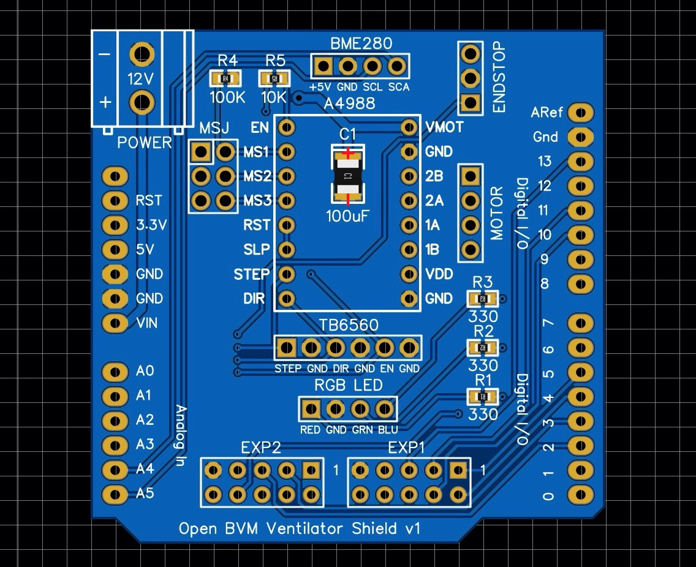
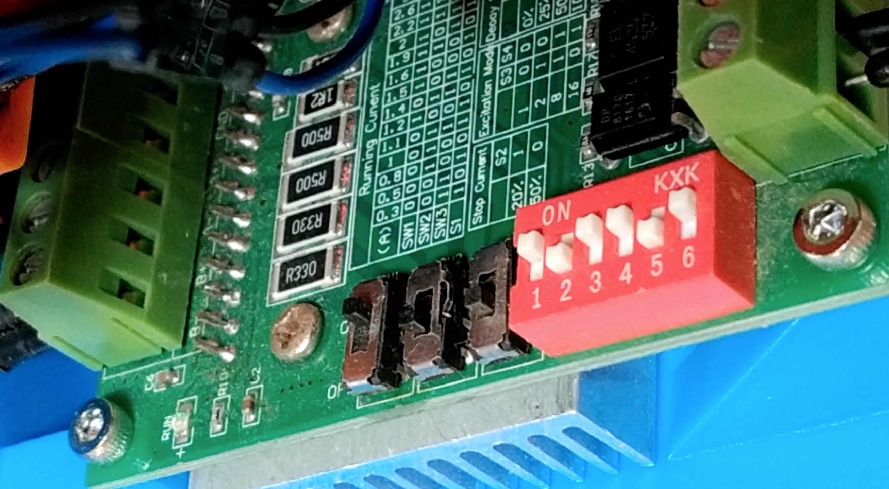

# Open BVM Ventilator project

This is a reference design and test platform for open source non-invasive bag valve mask ventilators. It features 3D printable parts and uses common off-the-shelf hardware and components.

3D Printable files can be found here and on [Thingiverse](https://www.thingiverse.com/thing:4335859).
Fusion 360 CAD files can be found here and on [GrabCAD](https://grabcad.com/library/open-bvm-ventilator-project-1).

## Specification

The Open BVM Ventilator is non-invasive and operates in universal mode (spontaneous pressure triggered ventilation with pressure-limited mandatory ventilation). It has been designed to meet all the applicable requirements outlined in the [Ventilator for COVID-19 use in Australia](spec/ventilator-covid-19-use-australia.pdf) document published on the [Australian Government, Department of Health, Therapeutic Goods Administration](https://www.tga.gov.au/ventilator-covid-19-use-australia) website.

### Assumptions

At the time this design was initiated it was assumed that early non-invasive ventilation with supplementary oxygen is beneficial for treating COVID-19 patients.

In order to meet all the requirements in the above document it is assumed that:

1. Supplementary oxygen will be provided to the bag via an externally regulated source (i.e. an oxygen cylinder or wall outlet).
2. A [HEPA exhalation filter](bom/BOM.md) will be installed between the manifold and mask.
3. A [PEEP regulator](bom/BOM.md) will be installed on the valve output to provide positive end-expiratory pressure.
4. An [extension hose](bom/BOM.md) may be used to connect the mask to the patient. However if used, the extension hose should be connected between the bag and the valve to limit the amount of dead space in the gas exchange.
5. The mask will be strapped to patient in order to provide a hands free airtight seal.

### Capabilities

The current Open BVM Ventilator design has the following capabilities:

* Respiratory air and oxygen is fed through a bag valve mask (Ambu bag) which is an approved medical device for hand resuscitation. The pressure sensor manifold is 3D printed with food grade PLA.
* All controls are adjustable in real time and provide live feedback though mechanical output and the user interface.
* Minute Volume (Mv) and Peak Inspiratory Pressure (Pip) are displayed after each respiratory cycle.
* Pressure-limited mandatory ventilation is controlled via the Respiratory Rate (Rr) and Tidal Volume (Vt).
* Spontaneous ventilation is triggered via negative pressure on the the pressure sensor attached to the manifold (Controls page / Trigger Pressure). 
* Positive end expiratory pressure (PEEP) is provided by a [regulator](bom/BOM.md) attached to the valve output.
* Quick adjustment of Tidal Volume (Vt), Respiratory Rate (Rr) and Plateau Airway Pressure (Paw) is available on the user interface main page.
* Airway pressure safety is set via the maximum pressure limit (Limits page / Pressure / Maximum).
* Pressurised air is not required, therefore the unit can be operated outside of an ICU using only bottled oxygen and a power supply.
* All ventilator controls are accessed via the LCD display, stop button and encoder on the [Reprap Discount Full Graphic Smart Controller](https://reprap.org/wiki/RepRapDiscount_Full_Graphic_Smart_Controller).
* Tidal Volume has been [calibrated and verified](spec/calibration.pdf).
* Both visual and audible alarms are generated and logged on the Events page.
* 12v power can be provided via an AC adapter or external battery.
* All parts can be 3D printed with food safe PLA plastic.

These capabilities have been verified with static tests using a manometer but will require more comprehensive dynamic testing to be considered validated. Some dynamic testing using a water column to simulate pressure and volume has also been undertaken.

### Outstanding Issues

1. Maximum inspiratory and expiratory flow is limited to 35 l/min by the maximum stepper motor RPM and torque. I will attempt to resolve this by using a TMC2209 driver and by adding a DC Step Up to 24v for the Stepper motor power supply.
2. The current stepper driver is noisy and will to be replaced with a TMC2209 driver. However this will require the addition of a cooling fan.
3. **Time and resources:** when I started this project a critical lack of ventilators was in the news. Now that we have *flattened the curve* - particularly here in Australia - not so much. I self-funded this project and spent weeks working on it. I need to get back to work and earn a living, so unless others want to pitch in and help, I am not sure how much more I can do on my own.

## Hardware

The Open BVM Ventilator is comprised of 25 x 3D printed parts and various off-the-shelf hardware, electronic components and fasteners.

A list of all the required hardware, fasteners, electronic components and 3D printed parts can be found in the **[Bill of Materials](bom/BOM.md)**.

## Firmware

The firmware features a real time model view controller architecture with custom stepper speed control that supports linear acceleration with rpm adjustment inside position changes.

The firmware can be downloaded, compiled and uploaded to the Arduino Uno board using the [Arduino IDE](https://www.arduino.cc/). 

The firmware is dependent on the following libraries:

* [BME280I2C](https://github.com/finitespace/BME280)
* [FastIO](https://github.com/whpthomas/FastIO)
* [U8g2lib](https://github.com/olikraus/u8g2)

The factory reset function found on the System Page should be selected the first time the system is run to set all the EEPROM control variables to know values.

## Electronics

A control shield for the Arduino Uno can be found at [easyeda.com/whpthomas/open-bvm-ventilator-shield](https://easyeda.com/whpthomas/open-bvm-ventilator-shield). The shield has been designed to allow all the electronic components to be easily connected using either Dupont connectors or by directly soldered wires. The circuit supports use of either the TB6560 or A4988 (or compatible) stepstick driver.

Fully assembled boards can be ordered directly from [JLCPCB](https://jlcpcb.com/), [PCBWay](https://www.pcbway.com/) or other suitable PCB prototyping services using the Gerber files, bill of materials and pick and place files found in the [`/pcb`](https://github.com/whpthomas/open_bvm_ventilator/tree/master/pcb) folder.

The following digital pins on the Arduino Uno are used in the [schematic](https://github.com/whpthomas/open_bvm_ventilator/blob/master/pcb/Shield_SCH-v1.pdf):

* **2** Controller Rotary Encoder A (Interrupt 0)
* **3** Controller Rotary Encoder B (Interrupt 1)
* **4** Controller Rotary Encoder Button
* **5** Controller Buzzer
* **6** Controller Stop Button
* **7** LED Red
* **8** LED Green
* **9** LED Blue
* **10** LCD Chip Select (SS)
* **11** LCD Data In (MOSI)
* **13** LCD Clock (SCK)
* **A0** Home Endstop
* **A1** Stepper Driver Step
* **A2** Stepper Driver Direction
* **A3** Stepper Driver Enable
* **A4** BME280 Pressure Sensor IC2 SDA
* **A5** BME280 Pressure Sensor IC2 SCK

#### A4988 Jumper Settings

Jumpers are used on the MSJ header to set the microstep resolution. The default configuration is to place a jumper across MS1 and MS2 for 1/8 microstep resolution.

MS1|MS2|MS3|Microstep Resolution
----|----|----|----
Low|Low|Low|Full step
High|Low|Low|1/2 step
Low|High|Low|1/4 step
High|High|Low|1/8 step
High|High|High|1/16 step

#### TB6560 Switch Configuration

Switches are used on the TB6560 stepper driver to set the current and microstep resolution.

I recommend configuring the TB6560 with the following settings.

Switch|State|Configuration
----|----|----
SW1|ON|1.2A
SW2|OFF|1.2A
SW3|OFF|1.2A
S1|ON|1.2A
S2|OFF|50% Stop Current
S3|ON|1/8 steps
S4|ON|1/8 steps
S5|OFF|50% Delay
S6|ON|50% Delay

----

# TERMS OF USE

Open BVM Ventilator reference designs are intended for educational purposes, ARE NOT CERTIFIED FOR MEDICAL USE, ARE PROVIDED "AS IS" AND "WITH ALL FAULTS". Dr. Henry Thomas DISCLAIMS ALL OTHER WARRANTIES, EXPRESS OR IMPLIED, INCLUDING BUT NOT LIMITED TO, ANY IMPLIED WARRANTIES OF MERCHANTABILITY OR FITNESS FOR A PARTICULAR PURPOSE. Dr. Henry Thomas may make changes to reference design specifications and descriptions at any time, without notice.