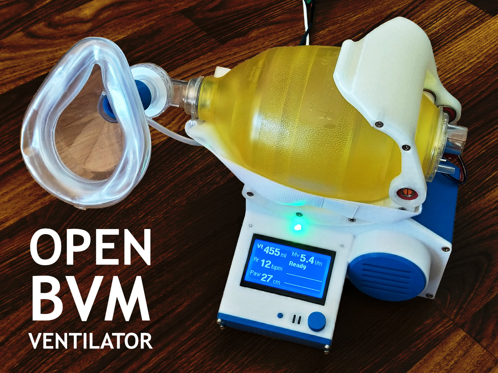
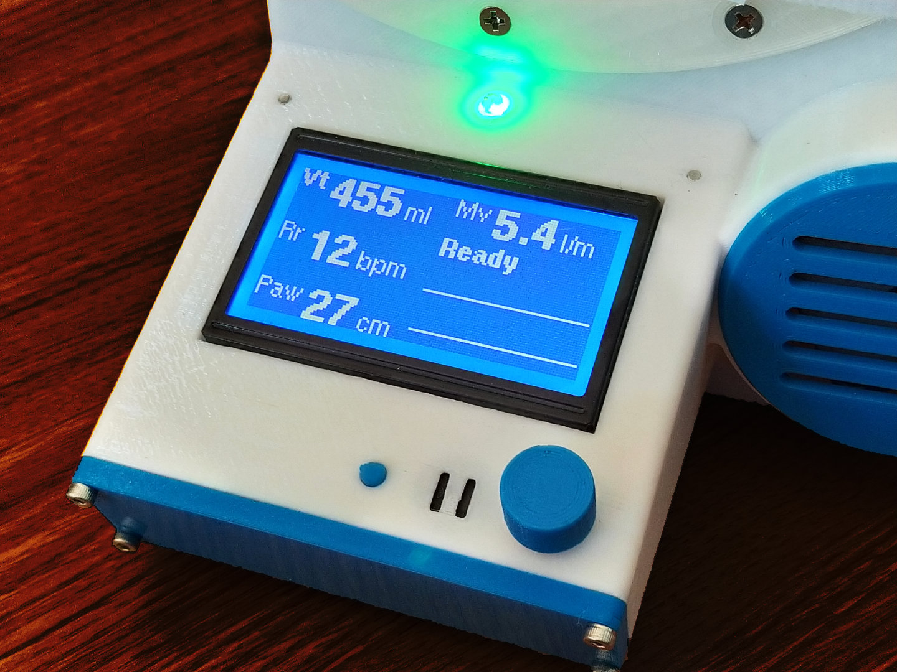
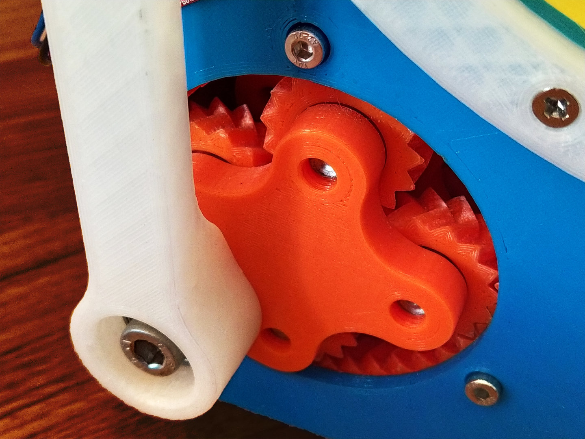
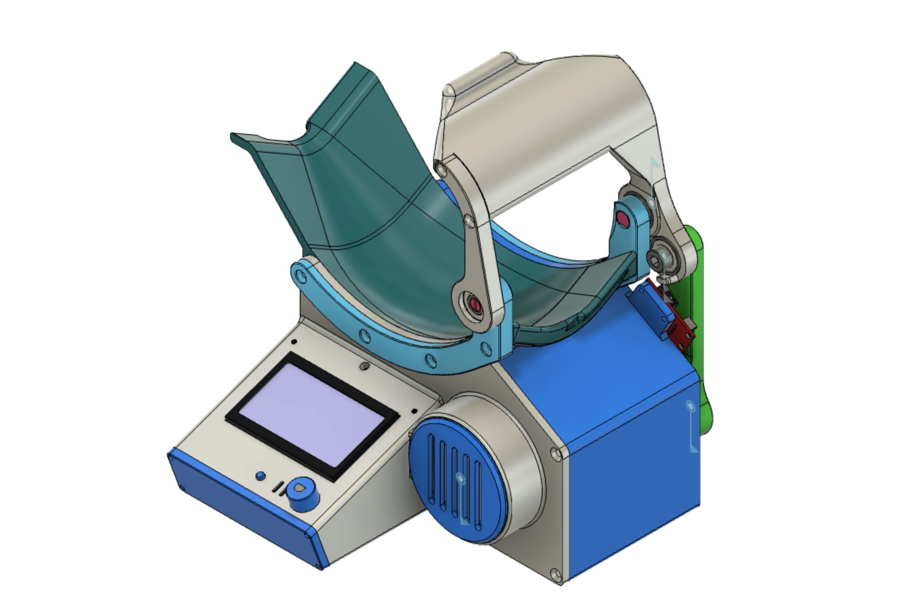

# Open BVM Ventilator project

This is a reference design and test platform for open source non-invasive bag valve mask ventilators. It features 3D printable parts and uses common off-the-shelf hardware and components.

## Specification

The Open BVM Ventilator is non-invasive and operates in universal mode (spontaneous pressure triggered ventilation with pressure-limited mandatory ventilation). It has been designed to meet all the applicable requirements outlined in the [Ventilator for COVID-19 use in Australia](spec/ventilator-covid-19-use-australia.pdf) document published on the [Australian Government, Department of Health, Therapeutic Goods Administration](https://www.tga.gov.au/ventilator-covid-19-use-australia) website.

### Assumptions

At the time this design was initiated it was assumed that early non-invasive ventilation with supplementary oxygen is a beneficial treatment for COVID-19 patients.

In order to meet all the requirements in the above document it is assumed that:

1. Supplementary oxygen will be provided to the bag via an externally regulated source (i.e. an oxygen cylinder or wall outlet).
2. A HEPA exhalation filter will be installed between the manifold and mask.
3. A PEEP regulator will be installed on the valve output to provide positive end-expiratory pressure.
4. An extension hose may be used to connect the mask to the patient. However if used, the extension hose should be connected between the bag and the valve to limit the amount of dead space in the gas exchange.
5. The mask will be strapped to patient in order to provide a hands free airtight seal.

### Capabilities

The current Open BVM Ventilator design has the following capabilities:

* A real time system where all controls can be adjusted and provide live feedback though mechanical output and the user interface.
* Minute Volume (Mv) and Peak Inspiratory Pressure (Pip) is displayed after each respiratory cycle.
* Pressure-limited mandatory ventilation is controlled via the Respiratory Rate (Rr) and Tidal Volume (Vt).
* Spontaneous ventilation is triggered via negative pressure on the manifold attached to the pressure sensor (Controls page / Trigger Pressure). 
* Positive end expiratory pressure (PEEP) is provided by a regulator attached to the valve output.
* Quick adjustment of Tidal Volume (Vt), Respiratory Rate (Rr) and Plateau Airway Pressure (Paw) is available on the user interface main page.
* Airway pressure safety is set via the maximum pressure limit (Limits page / Pressure / Maximum).
* Pressurised air is not required, therefore the unit can be operated outside of an ICU using only bottled oxygen and a power supply.
* All ventilator controls are accessed via the LCD display, stop button and encoder on the [Reprap Discount Full Graphic Smart Controller](https://reprap.org/wiki/RepRapDiscount_Full_Graphic_Smart_Controller).
* Both visual and audible alarms are generated and logged on the events page.
* 12v power can be provided via an AC adapter or external battery.
* All parts can be 3D printed with food safe PLA plastic.

These capabilities have been verified with static tests but will require more comprehensive dynamic testing to be considered validated. These dynamic tests are underway, however they require at least 14 days to complete.

### Outstanding Issues

1. The actual tidal volume is currently estimated and needs calibration.
2. Maximum inspiratory and expiratory flow is limited to 35 l/min by the maximum stepper motor RPM and torque. This may or may not be adequate for clinical use and therefore may require selection of a different stepper motor and driver combination to achieve the 100 l/min capability specified.
3. The current stepper driver is noisy and should to be replaced with a TMC2209 or equivalent. However this would require a cooling fan.

## Hardware

The Open BVM Ventilator is comprised of 25 x 3D printed parts and various off-the-shelf hardware, electronic components and fasteners.

A list of all the required hardware, fasteners, electronic components and 3D printed parts can be found in the **[Bill of Materials](bom/BOM.md)**.

## Firmware

The firmware features a real time model view controller architecture with custom stepper speed control that supports linear acceleration with rpm adjustment inside position changes.

The firmware can be downloaded, compiled and uploaded using the Arduino IDE. 

The firmware is dependent on the following libraries:

* [BME280I2C](https://github.com/finitespace/BME280)
* [FastIO](https://github.com/whpthomas/FastIO)
* [U8g2lib](https://github.com/olikraus/u8g2)

The factory reset function found on the System Page should be selected the first time the system is run to set all the EEPROM control variables to know values.

## Electronics

The ventilator control shield is currently being schematically captured and will be published shortly. It will allow all the electronic components to be easily connected.
